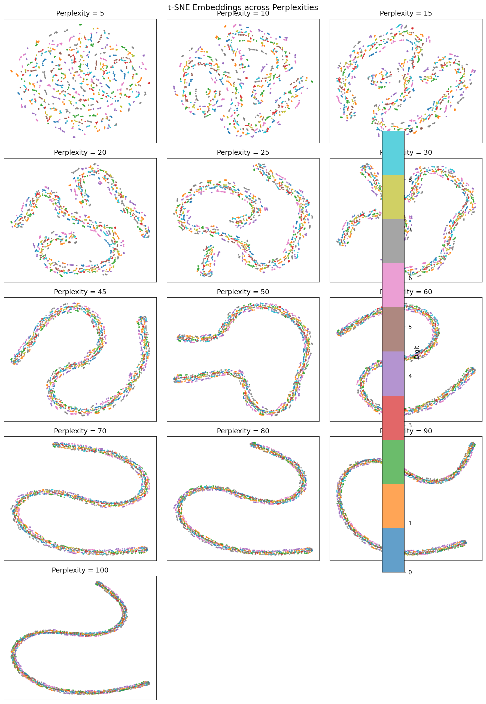
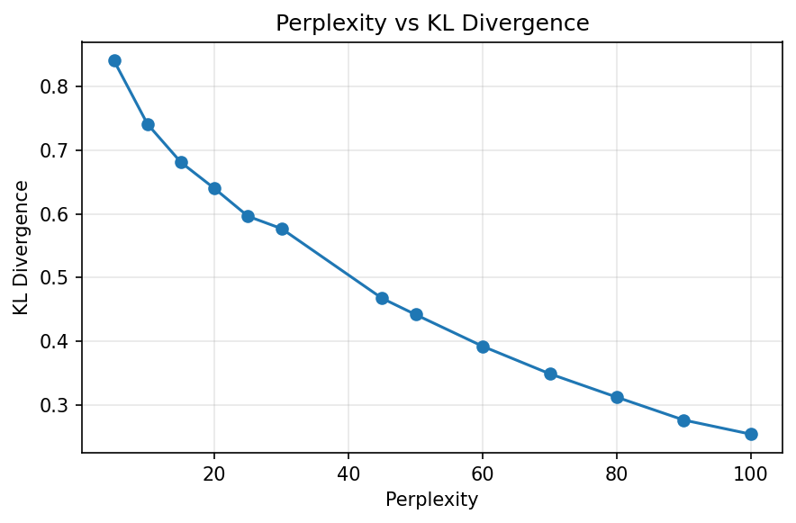
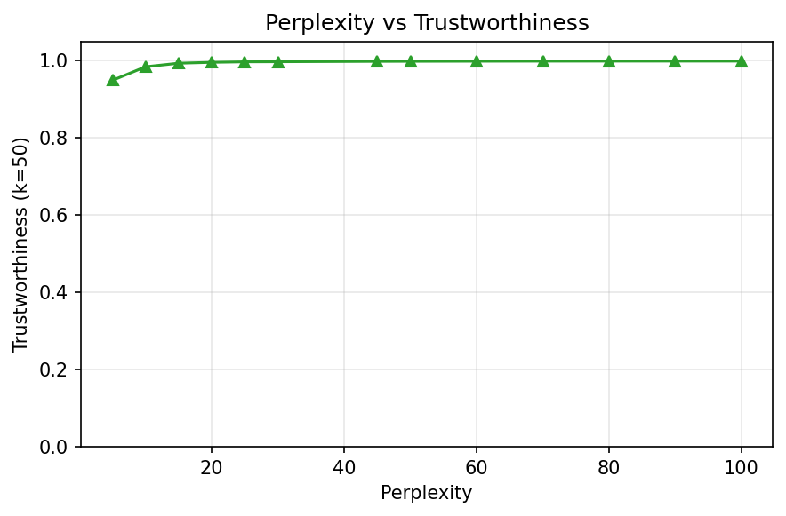
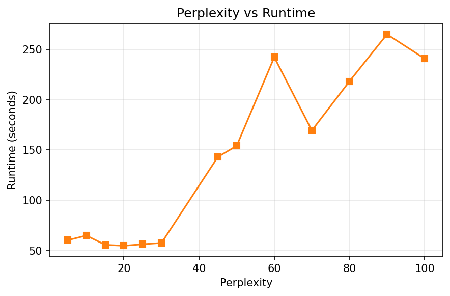
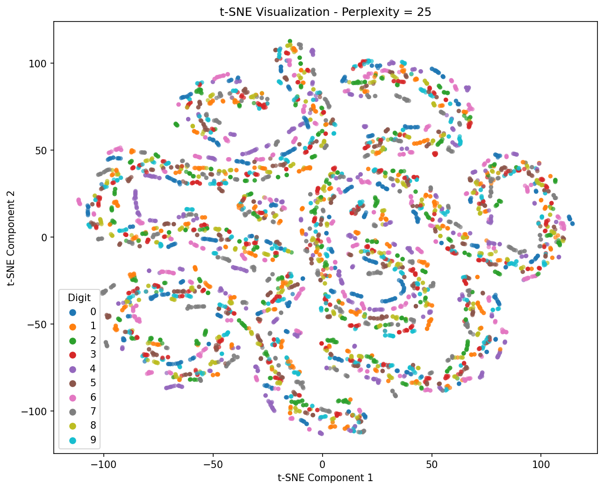

# t-SNE cho dữ liệu chữ số viết tay

Project cài đặt **exact t-SNE bằng NumPy** và dùng nó để giảm dữ liệu Optical Recognition of Handwritten Digits xuống 2 chiều. Notebook thực hiện tiền xử lý, thử nhiều giá trị perplexity, đánh giá kết quả và trực quan hóa các chữ số theo nhãn 0–9. Folder `tests/` kiểm tra các phép tính cốt lõi và đầu ra giảm chiều của thuật toán.

## Dataset

Dữ liệu gốc nằm trong `data/raw/`:

- `optdigits.tra`: 3.823 mẫu huấn luyện;
- `optdigits.tes`: 1.797 mẫu kiểm thử;
- `optdigits.names`: mô tả bộ dữ liệu.

Mỗi mẫu gốc gồm 64 giá trị nguyên từ 0 đến 16, biểu diễn ảnh 8×8, và một nhãn chữ số từ 0 đến 9. Theo file mô tả, dữ liệu không có giá trị thiếu.

Notebook ghép hai tập thành 5.620 mẫu, đặt tên các cột `Pixel_1`–`Pixel_64` và `label`, rồi lưu vào `data/processed/optdigits.csv`. Lệnh `to_csv` hiện tại không đặt `index=False`, vì vậy file đã xử lý có thêm cột index; `load_optdigits_csv()` lấy mọi cột trừ cột cuối làm `X`, nên quy trình hiện tại sử dụng cột index này cùng 64 đặc trưng pixel.

## Quy trình thực nghiệm

Quy trình trong `tsne_digits.ipynb.ipynb`:

1. Đọc hai file raw bằng pandas, kiểm tra số giá trị null và kích thước dữ liệu, sau đó ghép và lưu CSV đã xử lý.
2. Nạp CSV bằng `load_optdigits_csv()` và lấy 2.000 mẫu đầu để thử nghiệm.
3. Chạy t-SNE 2D với các perplexity `5, 10, 15, 20, 25, 30, 45, 50, 60, 70, 80, 90, 100`; mỗi lần chạy 500 vòng với `random_state=42`.
4. Đánh giá từng cấu hình bằng KL Divergence cuối, Trustworthiness tại **`k=50`** và runtime; lưu bảng CSV cùng bốn biểu đồ.
5. Hiển thị lại ảnh lưới embedding của các perplexity để quan sát trực tiếp cấu trúc phân cụm.
6. Sau khi đối chiếu metric và hình dạng các embedding, **perplexity = 25** được chọn để chạy trên toàn bộ 5.620 mẫu với 1.000 vòng.
7. Tạo scatter plot 2D bằng Seaborn, tô màu theo nhãn chữ số.

### Kết quả đánh giá theo perplexity

Bảng dưới đây được lấy từ `outputs/results/experiment_evaluation.csv`, tương ứng với thí nghiệm trên 2.000 mẫu đầu, 500 vòng lặp, `random_state=42` và Trustworthiness tại `k=50`:



| Perplexity | KL Divergence | Trustworthiness (k=50) | Runtime (giây) |
|-----------:|--------------:|----------------------:|----------------:|
| 5   | 0.841149 | 0.948917 | 60.26 |
| 10  | 0.741336 | 0.984014 | 64.90 |
| 15  | 0.681136 | 0.993240 | 55.68 |
| 20  | 0.640092 | 0.995545 | 54.76 |
| **25**  | **0.596478** | **0.996855** | **56.28** |
| 30  | 0.577071 | 0.997093 | 57.56 |
| 45  | 0.467548 | 0.998047 | 143.12 |
| 50  | 0.441998 | 0.998217 | 154.10 |
| 60  | 0.392190 | 0.998450 | 242.23 |
| 70  | 0.349039 | 0.998594 | 169.38 |
| 80  | 0.312239 | 0.998683 | 218.22 |
| 90  | 0.276323 | 0.998710 | 265.03 |
| 100 | 0.254121 | 0.998711 | 240.82 |

### Phân tích kết quả

#### KL Divergence



KL Divergence giảm liên tục từ `0.841149` tại perplexity 5 xuống `0.254121` tại perplexity 100. Điều này cho thấy các cấu hình perplexity lớn khớp phân phối xác suất giữa không gian gốc và không gian 2D tốt hơn theo hàm mục tiêu của t-SNE. Tuy nhiên, KL thấp không tự động đồng nghĩa với hình trực quan dễ diễn giải nhất.

#### Trustworthiness



Với `k=50`, Trustworthiness tăng nhanh từ `0.948917` ở perplexity 5 lên `0.996855` ở perplexity 25, sau đó chỉ tăng nhẹ và đạt `0.998711` ở perplexity 100. Vì vậy, perplexity 25 đã bảo toàn lân cận ở mức rất cao; mức cải thiện định lượng khi tiếp tục tăng perplexity là nhỏ.

#### Runtime



Các cấu hình từ 5 đến 30 mất khoảng 55–65 giây trong lần đo đã lưu. Từ perplexity 45 trở lên, runtime nhìn chung cao hơn và dao động mạnh, đạt 265,03 giây tại perplexity 90. Runtime phụ thuộc máy và trạng thái thực thi, vì vậy các số này dùng để so sánh trong lần chạy hiện tại, không phải benchmark cố định.

#### Ảnh hưởng đến hình dạng embedding

- Ở perplexity 5–15, embedding bị chia thành nhiều đoạn và cụm nhỏ, bố cục còn rời rạc.
- Trong vùng 20–30, cấu trúc cục bộ trở nên liền mạch hơn nhưng vẫn giữ được nhiều vùng riêng biệt.
- Từ perplexity 45 đến 100, các điểm dần được tổ chức thành một vài dải cong dài. Dù các cấu hình này có KL Divergence thấp và Trustworthiness cao, hình chiếu bị nén mạnh hơn về mặt bố cục và khó quan sát sự đa dạng của các cấu trúc cục bộ.

### Kết quả trực quan cuối cùng: perplexity 25



**Perplexity 25 cho kết quả trực quan tốt nhất trong thử nghiệm này.** So với perplexity thấp, embedding bớt phân mảnh; so với perplexity rất cao, các cấu trúc cục bộ chưa bị ép thành một vài dải dài. Cấu hình này đồng thời đạt Trustworthiness `0.996855`, KL Divergence `0.596478` và runtime `56.28` giây trên tập thử 2.000 mẫu. Vì sự cân bằng giữa khả năng bảo toàn lân cận, chi phí chạy và khả năng quan sát cấu trúc 2D, perplexity 25 được dùng để giảm chiều toàn bộ 5.620 mẫu và trực quan hóa theo nhãn.

## Cách hoạt động

`core/tsne_numpy.py` triển khai t-SNE thuần NumPy: tính ma trận khoảng cách Euclid bình phương; tìm `beta` riêng cho từng điểm bằng binary search để khớp perplexity; đối xứng hóa xác suất trong không gian gốc; khởi tạo embedding gần gốc tọa độ; tính xác suất Student-t trong không gian thấp; rồi tối ưu KL Divergence bằng gradient descent với early exaggeration, momentum và adaptive gains. Đây là exact t-SNE nên cần bộ nhớ `O(N²)`.

Mô hình hỗ trợ dừng sớm sau giai đoạn early exaggeration khi KL không cải thiện đủ trong số vòng `patience`. `core/evaluation.py` chạy nhiều perplexity, đo thời gian, tính Trustworthiness với mặc định `k=50`, lưu kết quả và sinh các biểu đồ.

## Kiểm thử

Project có 22 test viết bằng pytest:

- `tests/test_tsne_core.py`: kiểm tra khoảng cách Euclid bình phương; entropy và xác suất; tìm `beta` theo perplexity; ma trận xác suất có điều kiện và đối xứng; phân phối Student-t; KL Divergence; khởi tạo embedding; gradient và một bước gradient descent.
- `tests/test_tsne_output.py`: chạy t-SNE trên hai cụm Gaussian tự sinh để kiểm tra shape 2D, bảo toàn số mẫu, giá trị hữu hạn, embedding không collapse, hành vi của `fit()`/`fit_transform()`, các thuộc tính sau khi fit và alias `fit_tranform()`.

Chạy toàn bộ test từ thư mục gốc:

```bash
pip install pytest
python -m pytest -q
```

`pytest` hiện chưa được liệt kê trong `requirement.txt`.

## Cách chạy

Yêu cầu Python 3.10+ và các thư viện được import trong project:

```bash
pip install -r requirement.txt
jupyter notebook tsne_digits.ipynb.ipynb
```

Chạy các cell theo thứ tự từ thư mục gốc của project. File dependency hiện có tên `requirement.txt`.

Có thể chạy demo trong module đánh giá bằng:

```bash
python -m core.evaluation
```

Demo này dùng 1.000 mẫu đầu, các perplexity `10, 30, 50` và 500 vòng.

## Outputs

- `outputs/results/experiment_evaluation.csv`: perplexity, KL Divergence, runtime và Trustworthiness.
- `outputs/figures/tsne_perplexity_grid.png`: lưới embedding của các perplexity đã thử.
- `outputs/figures/perplexity_vs_kl.png`: perplexity so với KL Divergence.
- `outputs/figures/perplexity_vs_runtime.png`: perplexity so với runtime.
- `outputs/figures/perplexity_vs_trustworthiness.png`: perplexity so với Trustworthiness tại `k=50`.
- `outputs/figures/tsne_perplexity_25.png`: embedding 2D cuối của toàn bộ dữ liệu với perplexity 25, tô màu theo nhãn.

## Cấu trúc chính

```text
core/                       Cài đặt t-SNE và hàm đánh giá
data/raw/                   Dữ liệu Optdigits gốc và mô tả
data/processed/             CSV được tạo bởi notebook
outputs/figures/            Biểu đồ kết quả
outputs/results/            Bảng metric
tests/                      Kiểm thử hàm cốt lõi và đầu ra giảm chiều
requirement.txt             Dependency để chạy notebook và source
tsne_digits.ipynb.ipynb     Notebook thực nghiệm chính
```
