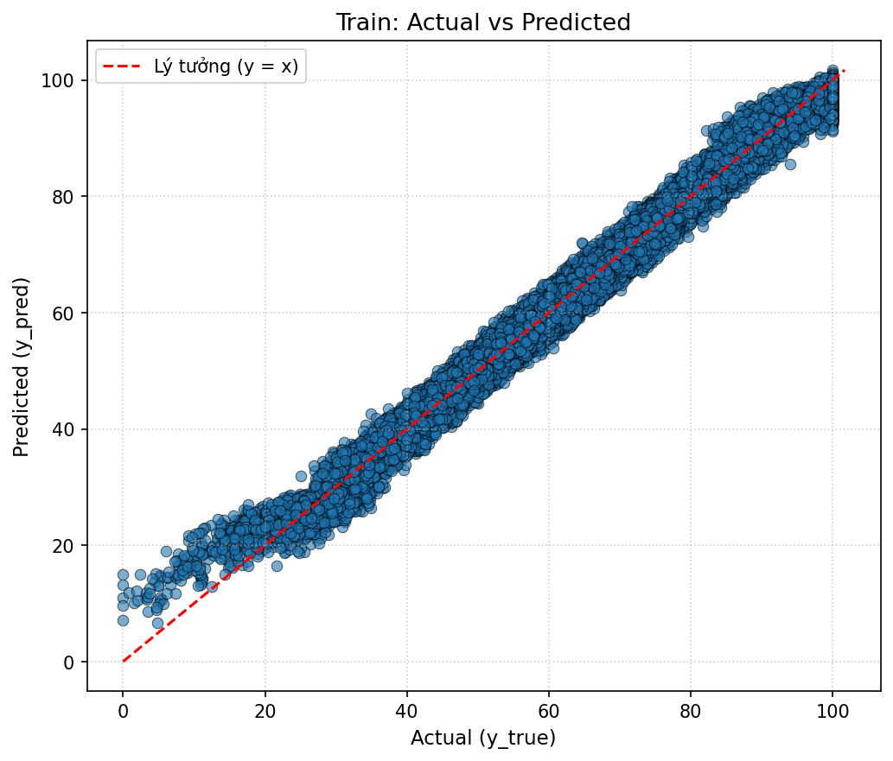
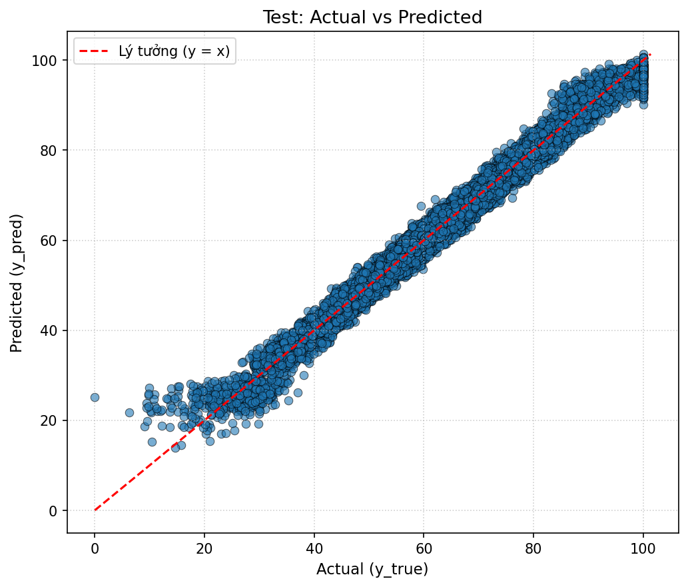
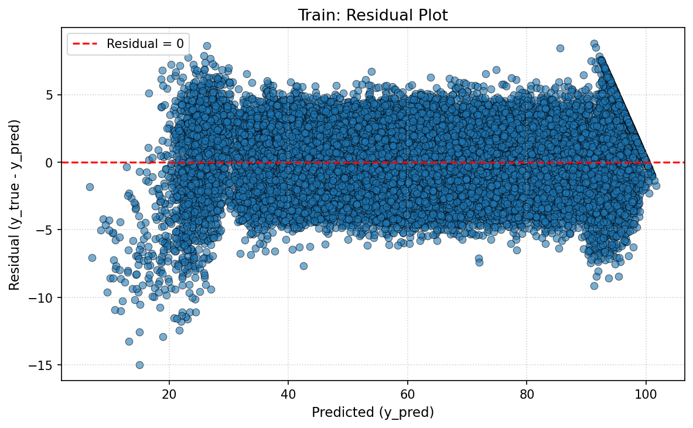
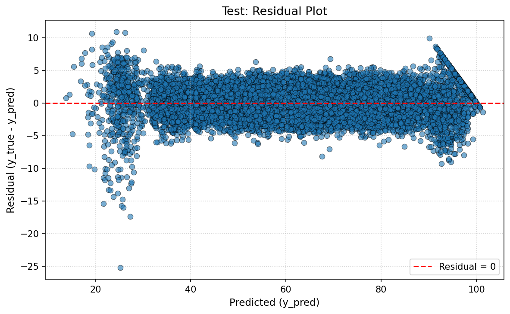
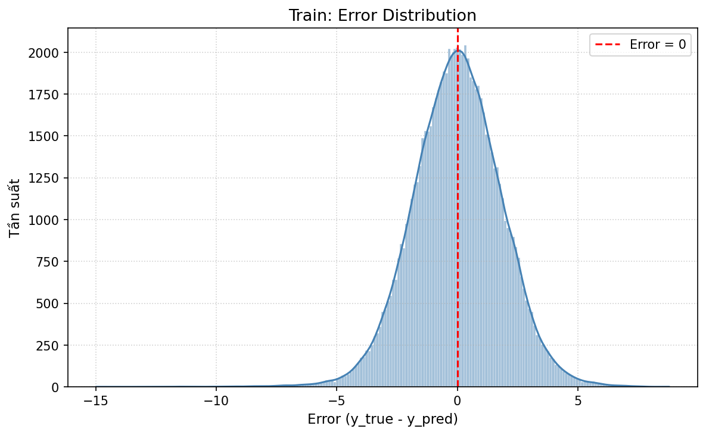
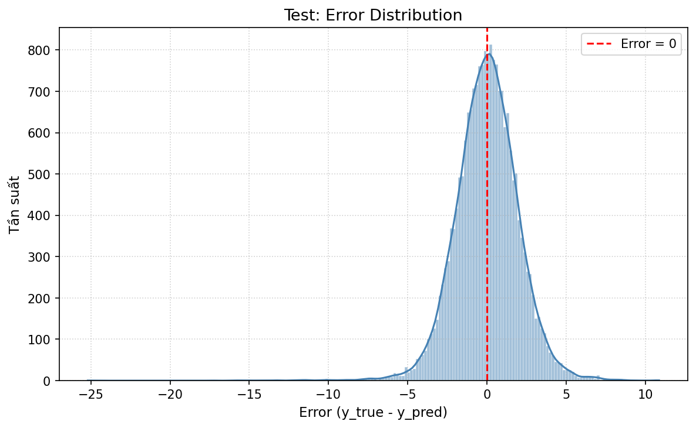
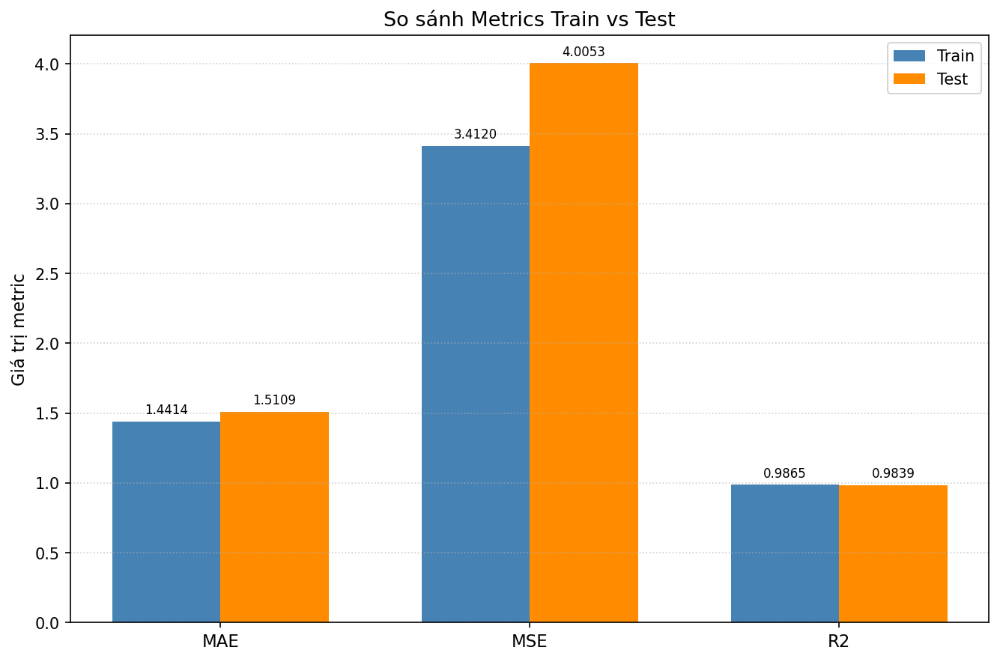
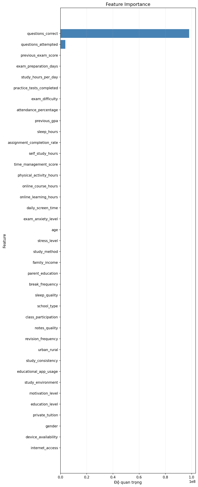

# LightGBM Regression — Dự đoán điểm thi sinh viên

Phần `regression` xây dựng một mô hình **LightGBM-style regressor từ đầu bằng Python/NumPy** để dự đoán biến liên tục `exam_score`. Mô hình không gọi estimator có sẵn từ package LightGBM; scikit-learn trong notebook chỉ được dùng cho các thao tác hỗ trợ như chia dữ liệu và mã hóa biến phân loại.

## Ý nghĩa bài toán

Dự đoán điểm thi giúp ước lượng sớm kết quả học tập từ lịch sử học tập, mức độ tham gia, thói quen ôn luyện, điều kiện học tập và trạng thái cá nhân của sinh viên. Kết quả có thể hỗ trợ phát hiện nhóm cần trợ giúp, phân bổ nguồn lực học tập và đánh giá yếu tố liên quan đến kết quả thi. Đây là công cụ hỗ trợ ra quyết định, không nên được xem là điểm số chính thức hoặc dùng đơn lẻ để đưa ra quyết định ảnh hưởng đến sinh viên.

`exam_score` là biến mục tiêu dạng số liên tục. Mỗi dự đoán là điểm thi mà mô hình kỳ vọng cho một sinh viên dựa trên các đặc trưng đầu vào; sai số dương `y_true - y_pred` nghĩa là mô hình dự đoán thấp hơn điểm thực tế, còn sai số âm nghĩa là mô hình dự đoán cao hơn.

## Cấu trúc thư mục

```text
regression/
├── lightgbm_regression.py
├── evaluation.py
├── data/
│   ├── raw/student_exam_performance.csv
│   └── processed/student_performance_processed.csv
├── notebooks/student_performance_prediction.ipynb.ipynb
├── metrics/
│   ├── mean_absolute_error.py
│   ├── mean_squared_error.py
│   ├── r2_score.py
│   └── regression_evaluation.py
├── visualization/
│   ├── actual_vs_predicted.py
│   ├── residual_plot.py
│   ├── error_distribution.py
│   ├── train_test_comparison.py
│   └── feature_importance.py
├── utils/validation.py
├── outputs/
│   ├── result/train_test_result.csv
│   └── figures/
└── tests/
```

## Dữ liệu đầu vào và tiền xử lý

Dataset gốc có **100.000 dòng và 44 cột**, gồm các nhóm thông tin về nền tảng và điều kiện học tập; kết quả và mức độ tham gia trước kỳ thi; thói quen học, chuẩn bị; điều kiện cá nhân; và hoạt động trong bài thi. Một số feature tiêu biểu là `previous_exam_score`, `previous_gpa`, `attendance_percentage`, `study_hours_per_day`, `practice_tests_completed`, `exam_difficulty`, `questions_attempted` và `questions_correct`.

Quy trình tiền xử lý hiện tại:

1. Loại `student_id` vì đây chỉ là mã định danh.
2. Loại `performance_grade`, `pass_status` và `performance_level` vì được suy ra từ điểm thi, có nguy cơ gây **target leakage**.
3. Điền missing của biến số bằng mean và biến phân loại bằng mode.
4. Dùng `OrdinalEncoder` cho 18 biến categorical.
5. Thu được 39 feature và một target `exam_score`, sau đó chia train/test theo tỷ lệ 80/20 với `random_state=42`.

> **Lưu ý đánh giá:** pipeline hiện fit bước điền thiếu và `OrdinalEncoder` trên toàn bộ dataset trước khi chia train/test. Dù không sử dụng trực tiếp target, cách làm này vẫn để test tham gia vào việc xác định thống kê và ánh xạ category. Để đánh giá chặt chẽ hơn, nên chia dữ liệu trước, chỉ fit transformer trên train rồi transform test.

## Mô hình và cách áp dụng

`lightgbm_regression.py` hiện thực các ý tưởng chính:

- Histogram binning theo quantile (`max_bins`).
- Phát triển cây leaf-wise/best-first.
- Gradient-based One-Side Sampling (GOSS) và Exclusive Feature Bundling (EFB).
- L1/L2 regularization, `min_gain_to_split` và `min_data_in_leaf`.
- Chọn nhánh xử lý missing theo gain tốt hơn.
- Feature importance dựa trên tổng split gain.

Thí nghiệm hiện dùng:

```python
n_estimators = 300
learning_rate = 0.05
num_leaves = 31
max_depth = -1
random_state = 42
```

Sau tiền xử lý, mô hình học tuần tự 300 cây hồi quy; mỗi cây mới tập trung hiệu chỉnh phần sai số còn lại của tổ hợp cây trước. Khi suy luận, đầu ra của các cây được cộng theo `learning_rate` để tạo một giá trị `exam_score` dự đoán. Learning rate nhỏ kết hợp nhiều cây giúp học quan hệ phi tuyến và tương tác giữa các feature, trong khi regularization và điều kiện dừng hạn chế cây học quá chi tiết dữ liệu train.

## Đánh giá kết quả

Các metric MAE, MSE và R² được cài đặt trong `metrics/`. Kết quả hiện tại:

| Split | MAE | MSE | R² |
|:--|--:|--:|--:|
| Train | 1.441448 | 3.411977 | 0.986483 |
| Test | 1.510870 | 4.005270 | 0.983888 |

- **MAE:** trên test, dự đoán lệch trung bình khoảng **1,51 điểm**; cao hơn train khoảng 0,069 điểm (4,8%). Đây là mức suy giảm nhỏ và dễ diễn giải trực tiếp theo đơn vị điểm thi.
- **MSE:** test đạt **4,0053**, cao hơn train khoảng 0,5933 (17,4%). Vì MSE bình phương sai số, mức tăng rõ hơn MAE cho thấy test có một số dự đoán sai lệch lớn ở phần đuôi phân phối.
- **R²:** mô hình giải thích khoảng **98,39%** phương sai điểm thi trên test, chỉ thấp hơn train khoảng 0,0026. Đây là mức độ phù hợp rất cao trên phép chia hiện tại.

Khoảng cách train/test nhìn chung nhỏ: R² gần nhau và MAE chỉ tăng nhẹ, nên **chưa có dấu hiệu overfitting nghiêm trọng**. Việc MSE test tăng tương đối nhiều hơn MAE cho thấy vẫn có các trường hợp ngoại lệ mà mô hình tổng quát hóa kém hơn. Kết luận này chỉ áp dụng cho phép chia ngẫu nhiên hiện tại; cần cross-validation hoặc dữ liệu mới, đồng thời sửa quy trình fit transformer, trước khi khẳng định khả năng tổng quát hóa thực tế.

## Phân tích trực quan

### Actual vs Predicted



Trên train, phần lớn điểm nằm sát đường lý tưởng `y = x`, phù hợp với R² cao. Ở hai biên, dự đoán có xu hướng co về vùng trung tâm: điểm thật rất thấp thường bị dự đoán cao, còn điểm gần 100 có xu hướng bị dự đoán thấp nhẹ.



Tập test giữ được dải điểm bám gần đường lý tưởng, cho thấy quan hệ học được chuyển sang dữ liệu chưa thấy khá tốt. Độ phân tán lớn hơn ở vùng điểm thấp và một vài điểm lệch xa đường chéo giải thích vì sao MAE/MSE test cao hơn train.

### Residual Plot



Residual train chủ yếu tập trung quanh 0, nhưng độ phân tán không hoàn toàn đồng đều. Residual âm rõ hơn ở một số vùng điểm dự đoán thấp và hình nêm gần biên trên phản ánh hiệu ứng giới hạn của thang điểm; mô hình còn sai lệch có cấu trúc ở các trường hợp biên.



Residual test có hình dạng tương tự train, là tín hiệu tích cực về tính ổn định. Tuy nhiên có các ngoại lệ âm lớn ở vùng dự đoán khoảng 40–55 và độ phân tán tăng ở vùng biên; đây là các quan sát làm MSE test tăng mạnh hơn MAE.

### Error Distribution



Sai số train có phân phối dạng chuông, đỉnh gần 0, nghĩa là phần lớn dự đoán chỉ lệch ít và không có thiên lệch tổng thể lớn. Phần đuôi trái dài hơn cho thấy vẫn có trường hợp mô hình dự đoán cao hơn thực tế đáng kể.



Phân phối sai số test cũng tập trung gần 0 và gần giống train, phù hợp với nhận định tổng quát hóa tốt. Hai đuôi dài hơn, đặc biệt phía âm, xác nhận một số sai số lớn dù dự đoán điển hình vẫn chính xác.

### Train/Test Metrics Comparison



MAE và MSE test cao hơn train, còn R² thấp hơn nhẹ. Chênh lệch không lớn nên không biểu hiện overfitting mạnh; riêng khoảng cách MSE đáng chú ý hơn vì metric này nhạy với ngoại lệ. Ba metric có thang đo khác nhau, vì vậy chỉ nên so train với test trong từng metric.

### Feature Importance



`questions_correct` chiếm gần như toàn bộ tổng split gain, tiếp theo là `questions_attempted`; các feature khác đóng góp rất nhỏ trên thang đo hiện tại. Điều này hợp lý vì số câu đúng liên hệ trực tiếp với điểm thi, nhưng cũng cho thấy mô hình phụ thuộc mạnh vào thông tin chỉ có trong hoặc ngay sau kỳ thi. Nếu mục tiêu là cảnh báo sớm trước khi thi, cần loại hoặc thay thế các biến này để tránh một **proxy quá gần target**, rồi đánh giá lại. Importance theo gain phản ánh mức độ mô hình sử dụng biến, không chứng minh quan hệ nhân quả; có thể kết hợp permutation importance hoặc SHAP khi cần diễn giải sâu hơn.

## Ý nghĩa và giới hạn của dự đoán

Với MAE test khoảng 1,51, dự đoán phù hợp để ước lượng xu hướng hoặc sàng lọc trường hợp cần hỗ trợ, nhưng một dự đoán đơn lẻ vẫn có thể sai nhiều hơn mức trung bình. Độ chính xác rất cao phần lớn gắn với `questions_correct`, nên giá trị sử dụng phụ thuộc vào thời điểm feature này có sẵn. Khi triển khai cần xác định rõ thời điểm dự báo, giám sát sai số theo nhóm sinh viên và không diễn giải feature importance như tác động nhân quả.

## Chạy kiểm thử

Từ repository root:

```bash
python -m pytest regression/tests -p no:cacheprovider
```
